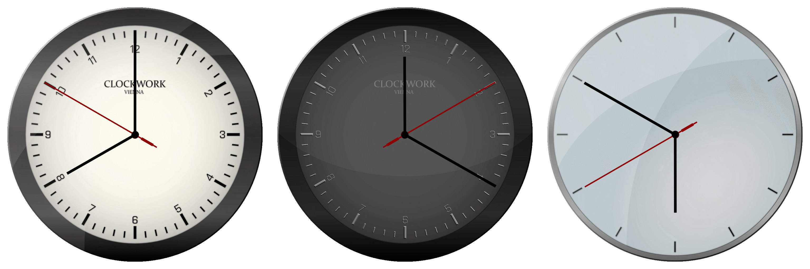

# Good Old Clock Widget

A small cross-platform executable that displays an analog clock.
It ships with various designs and can easily be tweaked by modifying a JSON configuration file.

## Controls

| Button           | Action                 |
|------------------|------------------------|
| Left mouse down  | Moves the widget       |
| Right mouse down | Changes the clock face |
| Mouse wheel      | Scales the clock       |

## Configuration file

The configuration file is located in the `faces` directory and is copied to the binary directory on build.
You can configure the clocks faces, hands and movement parameters.
The configuration file itself is self explainatory, take a look at [config.json](./faces/config.json).

### Available functions
| Function name          | Behaviour                                             |
|------------------------|-------------------------------------------------------|
| none                   | Static layer (default)                                |
| hour                   | Rotates 360 degrees in one 12 hours                   |
| minute                 | Rotates 360 degrees in one hour                       |
| second                 | Rotates 360 degress in one minute                     |
| second_discrete        | Same as `second` but jumps (Quartz clock style)       |
| second_discrete_smooth | Same as `second_discrete` but uses an easing function |
| millisecond            | Rotates 360 degrees in one second                     |

## Todos

- Remove the application from the task bar and move it to the notification area.
- Save and load the state from configuration directories (currently working directory).

## Copyright and license

The source code of this project is licensed under Zlib.
The clock faces and graphics included in this project are licensed under CC BY 4.0.

This project uses raylib (Zlib) for rendering and nlohmann json (MIT) for reading and writing JSON files.
